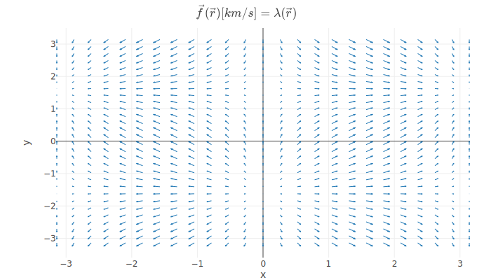

# Kamodo

[](https://codecov.io/gh/asherp/Kamodo)

Kamodo is a CCMC tool for access, interpolation, and visualization of space weather models and data in python. Kamodo allows model developers to represent simulation results as mathematical functions which may be manipulated directly by end users. Kamodo handles unit conversion transparently and supports interactive science discovery through jupyter notebooks with minimal coding and is accessible through python.


The project page is located at the Community Coordinated Modeling Center, located at NASA Goddard Space Flight Center.

* Official site page [https://ccmc.gsfc.nasa.gov/Kamodo/](https://ccmc.gsfc.nasa.gov/Kamodo/)

Kamodo's official source code is hosted on github under a permissive NASA open source license:

* [https://github.com/nasa/Kamodo](https://github.com/nasa/Kamodo)

Periodic contributions to Kamodo are made from the unofficial repo located here

* [https://github.com/asherp/Kamodo](https://github.com/asherp/Kamodo)


## Usage
Suppose we have a vector field defined by a function of positions in the x-y plane:

```python
from kamodo import kamodofy
import numpy as np

x = np.linspace(-np.pi, np.pi, 25)
y = np.linspace(-np.pi, np.pi, 30)
xx, yy = np.meshgrid(x,y)
points = np.array(zip(xx.ravel(), yy.ravel()))

@kamodofy(units = 'km/s')
def fvec(rvec = points):
    ux = np.sin(rvec[:,0])
    uy = np.cos(rvec[:,1])
    return np.vstack((ux,uy)).T
```

The @kamodofy decorator lets us register this field with units to enable unit-conversion downstream:
```python
from kamodo import Kamodo

kamodo = Kamodo(fvec = fvec)
kamodo
```
When run in a jupyter notebook, the above kamodo object will render as a set of equations:

$$\vec{f}{\left (\vec{r} \right )} [km/s] = \lambda{\left (\vec{r} \right )}$$

We can now evaluate our function using dot notation:

```python
kamodo.fvec(np.array([[-1,1]]))
```
```console
array([[-0.84147098,  0.54030231]])
```
We can perform unit conversion by function composition:
```python
kamodo['gvec[m/s]'] = 'fvec'
```
kamodo automatically generates the appropriate multiplicative factors:
$$\vec{g}{\left (\vec{r} \right )} [m/s] = 1000 \vec{f}{\left (\vec{r} \right )}$$
we can verify these results through evaluation

```python
kamodo.gvec(np.array([[-1,1]]))
```
```console
array([[-841.47098481,  540.30230587]])
```
Kamodo also generates quick-look graphics via function inspection.
```python
import plotly.io as pio

fig = kamodo.plot('fvec')
pio.write_image(fig, 'images/fig2d-usage.svg')
```


Head over to the [Introduction](notebooks/Kamodo.ipynb) page for more details.


## Getting started

Kamodo may be installed from pip

```console
pip install kamodo
```

To get the latest version, install from Asher's fork:

```console
pip install git+https://github.com/asherp/Kamodo.git
```

!!! note
    Asher's fork is periodically merged into the CCMC's official NASA version.

### Kamodo Environment 

We strongly recommend using the conda environment system to avoid library conflicts with your host machine's python.

Download and install miniconda from [here](https://conda.io/miniconda.html). The advantage to using miniconda is that each new environment includes the bare-minimum for a project. This allows you to keep many different projects on a single work station.

#### Create Kamodo environment

Create a new environment for kamodo

```console
conda create -n kamodo python==3.7
conda activate kamodo
(kamodo) pip install kamodo
```
!!! note
    The leading (kamodo) in your prompt indicates that you have activated the `kamodo` environment.
    From here on, anything you install will be isolated to the `kamodo` environment.

#### Loading example notebooks

If you want to run any of the notebooks in docs, you will need to install `jupyter`:

```console
(kamodo) conda install jupyter
```

Navigate to the top-level of the kamodo repo, then point jupyter to `docs/notebooks`:

    (kamodo) jupyter notebook docs/notebooks

This should open a browser window that will allow you to load any of the example notebooks.

#### Requirements

The following requirements are obtained by running `pip install kamodo`

* numpy
* scipy
* sympy
* pandas
* plotly==3.3 
* pytest
* psutil
* conda install antlr-python-runtime (rendering latex)
* conda install -c plotly plotly-orca (for writing images)

!!! note
    plotly version in flux


## Generating Docs

Kamodo's documentation site is a good example of how to embed your own plots in your own website.
The documentation site is generated by the `mkdocs` package with some addons

* mkdocs - handles site generation and deployment (configured by top-level `mkdocs.yaml`)
* markdown-include - allows for embedding of markdown files (and graph divs) outside the docs folder
* python-markdown-math - enables LaTeX rendering
* mknotebooks - allows for the embedding of jupyter notebooks

All of the above requirements can be installed with this line:

```console
pip install mkdocs python-markdown-math markdown-include mknotebooks
```

You can then generate the docs and serve locally with

`mkdocs serve`

To deploy your own documentation on github-pages:

`mkdocs gh-deploy`

This generates a gh-pages branch with the static site files and pushes it to github. Github automatically creates a website url based on that branch.

