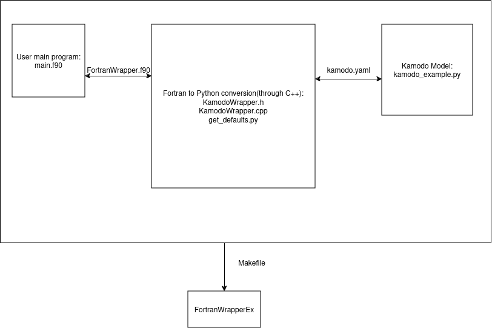

# How to install and run the program locally
Required compilers:
        g++ (13.2 or higher)
        gfortran (13.2 or higher)

Python version 3.10 libraries(use conda to create virtual environment for version control):
        setuptools (latest)
        kamodo (latest)

Required C++ libraries (you can get all of these using your OS package manager):
        python3.10-dev (it may have  a different name depending on your OS, I use Ubuntu 24)
        libyaml-cpp-dev (0.8.0 or higher)

Here are the commands to install the necessary libraries and environment, please modify according to your system:

- sudo apt-get install g++
- sudo apt-get install gfortran
- sudo apt-get install libyaml-cpp-dev

Now we create the python environment:

- conda create -n py310 python=3.10
- conda activate py310
- python -m pip install setuptools
- python -m pip install kamodo

Next, we install the python3.10-dev library:

- sudo apt-get install python3.10-dev
Note: in case of Ubuntu 24, the standard package manager doesn't have the python3.10-dev library, so you have to update it as followed:
- sudo apt install software-properties-common
- sudo add-apt-repository ppa:deadsnakes/ppa
- sudo apt update
- sudo apt-get install python3.10-dev

Finally, we go into the Makefile and modify the $CXXFLAGS, it should be the path to your Python.h file lying inside your environment,
in my case, it is: /home/duc/miniconda3/envs/py310/include/python3.10

Finally, we can compile the program, go to source code folder and type:
- make
- ./KamodoWrapperExample

To change the name of the output program or your Fortran main program, go into the Makefile and modify the variables $TARGET or $USER_FORTRAN_FILE

To make the program work with a different version of Python, modify the Makefile accordingly, and remember to get the right version of python3-dev libraries:
if you use python3.11, you need python3.11-dev, modify the $CXXFLAGS and $LDFLAGS variables

# How to run the program in Docker
Go to the folder where docker-compose.yml is located, and then run:

- docker compose up kamodo-wrap
- docker compose run kamodo-wrap

Now you should be inside the bash of the container, then do the following command:

- conda activate venv

- make

- ./KamodoWrapperExample

For development purposes, you can also use docker compose up kamodo-dev

You can also run the examples locally on your computer, you would need to have gnu13 compilers and python 3 between 3.8 and 3.10. You also probably need to update the makefile and the path to the yaml-cpp library.

# How to use the program
Next, I will explain in detail how to create your own program in Fortran that can call Kamodo models in Python, passing input and receiving back
output. 

## How the program is set up:
The program can be divided into 3 parts:

1. The Fortran main. Basically, this is the only part of the program you need to write yourself, this is where you create the model, call
the methods with your inputs and get back outputs. The provided example is **main.f90** . The link between part 1 and part 2 of the program is the file **FortranWrapper.f90**

2. The Fortran to Python conversion part. This part of the program are provided to you by us, and they are the following files: 

    **KamodoWrapper.h**

    **KamodoWrapper.cpp** 

    **get_defaults.py**

    You only need to take a look at **FortranWrapper.f90** and call functions inside that module in your main program. 

3. The Python Kamodo Model Reader. This part of the program is provided by the Kamodo Model Reader implementer in Python. Our Fortran to Python Conversion should work with any Kamodo Model Reader, and to link them together, the Python Kamodo Model Reader Implementer should use the **kamodo.yaml** config file to store necessary configurations for the Kamodo Model Reader. I will go into more details about how to create **kamodo.yaml** later.

The above design allows both the Fortran users and the Python Kamodo Model Reader Implementer flexibility. As you can see, this allows Fortran users to write Fortran code and Python Kamodo Model Reader Implementer to write Python code independently, and as long as they each match up with the Fortran to Python conversion part, the program should run. Thus, the Python Kamodo Model Reader Implementer can write many different Kamodo models, and the Fortran users can use them all without changing up the format.

## How to write the Fortran main for Fortran users
This part shows Fortran users how to write the main Fortran code. At the start of the program, always import FortranWrapper.f90 module and use iso_c_binding:

~~~
    use iso_c_binding
    use FortranWrapper
~~~

FortranWrapper provides you with 7 functions to interact with Python Kamodo Model Reader:

1.**constructor_kamodowrapper**

~~~
    function constructor_kamodowrapper(configpath) result(model_ptr)
            type(c_ptr),value :: model_ptr
            character(len=:),allocatable :: configpath
    end function constructor_kamodowrapper
~~~

>This function takes in an allocatable string configpath and return a c pointer 
>to an instance of Kamodo Model Reader. The configpath is the path to your **kamodo.yaml** file.

>You can use the function in the following manner:
~~~
    type(c_ptr) :: model_ptr
    character(len=:),allocatable::cf_path
    cf_path = 'kamodo.yaml'
    model_ptr = constructor_kamodowrapper(cf_path)

~~~
>You always have to call the constructor before you can use the other 6 functions.

2.**print_all_methods_kamodo_wrapper**

~~~
    subroutine print_all_methods_kamodowrapper(model_ptr)
        type(c_ptr) :: model_ptr
    end subroutine print_all_methods_kamodowrapper
~~~

>This function prints out all methods that you can use with your KamodoModelReader

>You can use ithe subroutine in the following manner: 
~~~
    call print_all_methods_kamodowrapper(model_ptr)
~~~
>If you run this with our provided example, you will see 2 methods name being printed out in the terminal: **rho** and **rho_ijk**

3.**print_method_metadata_kamodowrapper**

~~~
    subroutine print_method_metadata_kamodowrapper(model_ptr, method_name)
        type(c_ptr) :: model_ptr
        character(len=:),allocatable :: method_name
    end subroutine print_method_metadata_kamodowrapper
~~~

>This function prints out the metadata of method given by the allocatable string method_name. The metadata included units, args_units, equations, hidden_args, citation.

>You can use the subroutine in the following manner:

~~~
    character(len=:),allocatable::method_name
    method_name = 'rho_ijk'
    call print_method_metadata_kamodowrapper(model_ptr, method_name)
~~~

4.**print_method_defaults_kamodowraper**
~~~
    subroutine print_method_defaults_kamodowrapper(model_ptr, method_name)
        type(c_ptr) :: model_ptr
        character(len=:),allocatable :: method_name
    end subroutine print_method_defaults_kamodowrapper
~~~
>This function prints out the default arguments for the method given by the allocatable string method_name. If method doesn't have any default argument, it will print out "{}"

>You can use the subroutine in the following manner:

~~~
    character(len=:),allocatable::method_name
    method_name = 'rho_ijk'
    call print_method_defaults_kamodowrapper(model_ptr, method_name)
~~~

5.**call_method_with_defaults_kamodowrapper**
~~~
    subroutine call_method_with_defaults_kamodowrapper(model_ptr, method_name,& 
                                                       out_array, out_arr_shape)
            type(c_ptr)  :: model_ptr
            character(len=:),allocatable :: method_name
            real(c_double),dimension(:)  :: out_array
            integer(c_int), dimension (:) :: out_arr_shape
    end subroutine call_method_with_defaults_kamodowrapper
~~~
>This function calls method given by method_name and then the output of the method will be stored inside out_array. There are a few assumption we make here:

>   - out_array is an one dimensional array. We do this because different methods may require different shape of the output, so in order for the above functions to work with any method, we must always flatten the output. 

>   - The variable out_arr_shape will hold the actual shape of the output before being flattened, which allows us to reconstruct the original output.

>   - To use the above function for different method, you need to know exactly what the shape of the output is so you can allocate out_array_ptr to store the output.

>   - We also assume all data is of type real(c_double), and all the arrays are allocated at runtime. 

>Here is a simple example of using the above subroutine:

~~~
    character(len=:),allocatable:: method_name
    real(c_double), dimension(:,:,:), allocatable :: output
    real(c_double), dimension(:), allocatable :: flat_output

    method_name = 'rho'

    allocate(output(4,4,3))

    !because 4*4*3=48
    allocate(flat_output(48))
    
    call call_method_with_defaults_kamodowrapper(model_ptr,method_name,flat_output,shape(output))

    !reshape the flat output to original shape
    output = reshape(flat_output,shape(output))

~~~

6.**call_method_with_input_kamodowrapper**
~~~
    subroutine call_method_with_input_kamodowrapper(model_ptr, method_name, &
                                                    in_array, in_arr_shape, &
                                                    out_array, out_arr_shape)
            type(c_ptr) :: model_ptr
            character(len=:),allocatable :: method_name
            real(c_double),dimension(:)  :: in_array, out_array
            integer(c_int), dimension (:) :: in_arr_shape, out_arr_shape
    end subroutine call_method_with_input_kamodowrapper
~~~
>This function is very similar to the function **call_method_with_defaults_kamodowrapper**, except now we have to flatten both the input and the output. We make the same assumptions as **call_method_with_defaults_kamodowrapper**:

>   - in_array and out_array are one dimensional arrays. We do this because different methods may require different shape of the input and output, so in order for the above functions to work with any method, we must always flatten the input and output. 

>   - The variables in_arr_shape and out_arr_shape will hold the actual shape of the input and output before being flattened, which allows us to reconstruct the original input and output.

>   - To use the above function for different method, you need to know exactly what the shape of the input and output is so you can allocate in_array and out_array to store the input and output.

>   - We also assume all data is of type real(c_double), and all the arrays are allocated at runtime. 

>Here is a simple example of using the above subroutine:

~~~
    character(len=:),allocatable:: method_name
    real(c_double), dimension(:,:), allocatable :: input
    real(c_double), dimension(:,:,:), allocatable :: output
    real(c_double), dimension(:), allocatable:: flat_input, flat_output

    method_name = 'rho_ijk'

    allocate( input(3,3) )
    !because 3*3 = 9
    allocate(flat_input(9))

    !populate the input
    do l = 1, 3
        do j = 1, 3
            input(l, j) = l*3 + j
        end do
    end do

    flat_input =reshape(input, shape(flat_input))

    allocate(output(4,9,3))
    !because 4*9*3 = 108
    allocate(flat_output(108))

    call call_method_with_input_kamodowrapper(model_ptr, method_name,flat_input,shape(input),flat_output,shape(output))                 
                                             

    !reshape the flat output to original shape
    output = reshape(flat_output,shape(output))
~~~

7.**destructor_kamodowrapper**
~~~
    subroutine destructor_kamodowrapper(model_ptr)
        type(c_ptr) :: model_ptr
    end subroutine destructor kamodowrapper(model_ptr)
~~~
>This function must be called at the end of the program, after you have finished using your Kamodo model in order to deallocate all the data taken up by the model.

>Here is how you can use it:

~~~
    call destructor_kamodowrapper(model_ptr)
~~~

To see complete programs check out the examples folder, just copy the content of the files into the main.f90 to run the examples, or you can modify the CMakeLists.txt

#How to set up kamodo.yaml file
The kamodo.yaml file is the config file to basically send keyword arguments to your kamodo model to create the kamodo model. It has the following format:

~~~
models:
  mymodel:
    class: kamodo_example.MyModel
    params:
      filename: myfile.dat
module_paths:
  - .
~~~
You must always have this format. If your kamodo model file is **kamodo_example.py** and your class name is **MyModel**, then you put **kamodo_example.MyModel** in **class**. **module_paths** is the path to the file **kamodo_example.py**.

If you are designing your own kamodo models and you need extra parameters to specify your model, use kwargs and put the keyword arguments under **params** in kamodo.yaml
